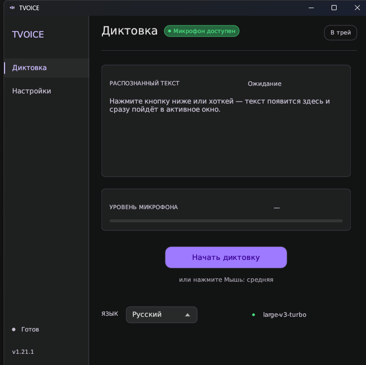

<div align="center">


# TVOICE

**Офлайн-диктовка для Windows 11.**
Нажали кнопку, сказали — текст появился в том окне, где вы печатали.
Ничего не уходит с вашей машины.

### [](https://github.com/DjonBeyron/Tvoice/releases/latest)

Бесплатно · офлайн · без аккаунта — установщик, права администратора не нужны

[](https://github.com/DjonBeyron/Tvoice/actions/workflows/ci.yml)
[](LICENSE)
[](#как-пользоваться)

**[English version](README.md)**



</div>

---

## Скачать

### **[⬇ Последний установщик для Windows](https://github.com/DjonBeyron/Tvoice/releases/latest)**

Бейдж версии выше всегда показывает то, что выложено сейчас. Возьмите со страницы релиза
`TVOICE-<версия>-setup.exe` и запустите — **права администратора не нужны**, программа
ставится в профиль пользователя.

> Для распознавания нужны движок и языковая модель, и в установщик они **не входят**:
> весят сотни мегабайт. Программа скачает их сама — см. [Первый запуск](#первый-запуск).

## Что умеет

- **Потоковая диктовка.** Слова появляются, пока вы ещё говорите, и уточняются на месте —
  а не возникают после того, как фраза закончилась.
- **Полностью офлайн.** Распознаёт локально через
  [whisper.cpp](https://github.com/ggerganov/whisper.cpp). Ни звук, ни текст никуда не
  отправляются, аккаунт и ключи не нужны.
- **Печатает в любое окно.** Текст идёт туда, где стоит курсор: редактор, браузер,
  мессенджер, терминал.
- **Любой хоткей, включая кнопки мыши.** Средняя кнопка работает не хуже сочетания клавиш.
- **Живёт в трее** и умеет запускаться вместе с Windows, свёрнутым.
- **Останавливается сам** после десяти секунд молчания.

## Требования

| | |
|---|---|
| ОС | Windows 10 1809+ или Windows 11, 64-бит |
| Микрофон | любое устройство записи; разрешение запрашивается при первом запуске |
| Диск | ~10 МБ под программу, ~700 МБ под движок и 75 МБ – 1.5 ГБ под модель |
| Видеокарта | не обязательна — whisper.cpp задействует CUDA, если есть NVIDIA, иначе считает на процессоре |

Программа использует Media Foundation — она есть во всех обычных редакциях Windows. На
редакциях `N`/`KN` сначала установите Media Feature Pack.

## Установка

1. Скачайте `TVOICE-<версия>-setup.exe` со страницы
   [последнего релиза](https://github.com/DjonBeyron/Tvoice/releases/latest).
2. Запустите. Установщик предложит ярлык в меню «Пуск», по желанию — ярлык на рабочем
   столе и запуск вместе с Windows.
3. Ставится в `%LOCALAPPDATA%\Programs\TVOICE`.

Место выбрано не от лени: программа держит настройки, журнал, движок и модели **рядом со
своим .exe**, а в `Program Files` обычный пользователь писать не может — там сломались бы
и сохранение настроек, и загрузка моделей.

Удаляется обычным образом через **Параметры → Приложения**. Скачанные модели при удалении
**остаются**: чтобы после переустановки не тянуть гигабайты заново. Если нужно вычистить
всё — удалите папку установки вручную.

## Первый запуск

1. Откройте **Настройки → «Движок и модели»**.
2. Нажмите **Скачать движок** — загрузится сборка whisper.cpp, с поддержкой CUDA, если у
   вас NVIDIA.
3. Выберите модель и скачайте её:

   | Модель | Размер | Для чего |
   |---|---|---|
   | `tiny` | 75 МБ | быстрая проверка, слабые машины |
   | `base` | 148 МБ | короткие заметки |
   | `small` | 488 МБ | компромисс |
   | **`large-v3-turbo`** | 574 МБ | **рекомендуется** — качество почти как у large, но быстро |
   | `medium` | 1.5 ГБ | максимальное качество, медленнее |

4. Вернитесь на экран **Диктовка**, проверьте хоткей и нажмите **Начать диктовку**.

## Как пользоваться

**Хоткей.** По умолчанию `Ctrl + Alt + Space`. Меняется в **Настройках → «Ввод»**: нажмите
*Задать* и зажмите нужное сочетание. Кнопки мыши тоже принимаются.

**Потоковый режим** (по умолчанию) делает хоткей **переключателем**: нажали — начали,
нажали снова — закончили. Удержание здесь намеренно не используется: зажатые клавиши
«протекали» бы символами в целевое окно.

**Язык интерфейса.** Русский или английский, переключается в **Настройках → «Микрофон и
система» → «Язык интерфейса»** и применяется сразу, без перезапуска. Установщик спрашивает
язык в начале, и программа открывается на нём; если выбор не делали ни разу, берётся язык
Windows. Это не то же, что язык *распознавания* на экране «Диктовка» — тот про то, на каком
языке вы говорите.

**Индикатор.** Рядом с курсором пульсирует небольшая пилюля. Место и размер настраиваются.

**Автовыход.** Десять секунд молчания закрывают захват и убирают индикатор — забытый
хоткей не оставит микрофон открытым.

**Звуки.** `rec.mp3` рядом с .exe играет при входе в диктовку, он же развёрнутый — при
выходе. Удалите файл, чтобы работать в тишине, или замените своим: обратная версия
пересобирается сама.

## Диагностика

Программа сама себе стенд. Всё перечисленное работает без интерфейса:

```bash
tvoice --probe                              # доступ к микрофону и список устройств
tvoice --vad-file <файл.wav>                # разбор речь/тишина по файлу, повторяемо
tvoice --idle-test [файл.wav]               # проверка автовыхода по 10с молчания
tvoice --sound-test [раз]                   # сигналы входа/выхода и их задержка
tvoice --stt-bench <wav> <эталонный текст>  # качество распознавания, числом
tvoice --rewrite-sim <черновик> …           # сколько текста переписывает уточнение
tvoice --autostart status|on|off            # запись автозапуска в реестре
```

Всё происходящее пишется в `tvoice.log` рядом с .exe: пороги речи/тишины, каждый черновик
распознавания, каждая вставка. Когда диктовка ведёт себя странно, причина обычно там.

## Как устроено

| Этап | Где | Существенное |
|---|---|---|
| Микрофон | [`src/mic/`](src/mic) | три слоя: тумблеры приватности в реестре, WinRT `MediaCapture` для системного диалога и прямой WASAPI как резерв — некоторые драйверы отклоняют разделяемый режим с `E_INVALIDARG`, тогда пробуем эксклюзивный |
| Речь/тишина | [`src/vad.rs`](src/vad.rs) | уровень фона — низкий процентиль энергии за 5 секунд, считается независимо от решения «речь/тишина», поэтому защёлкнуться не может |
| Распознавание | [`src/server.rs`](src/server.rs) | резидентный `whisper-server`: модель грузится один раз и висит в памяти, запросы по HTTP. Привязан к Job Object, поэтому умирает вместе с программой даже при краше |
| Цикл диктовки | [`src/streaming.rs`](src/streaming.rs) | текущая фраза — черновик, распознаётся заново каждые ~400 мс и правится на месте минимальной правкой |
| Вставка | [`src/inject.rs`](src/inject.rs) | буфер обмена + `Ctrl+V` (атомарно), запасной путь — посимвольный Unicode-ввод для терминалов |
| Индикатор | [`src/overlay.rs`](src/overlay.rs), [`src/hud.rs`](src/hud.rs) | нативное layered-окно Win32 в своём потоке: click-through, фокус не забирает |

Комментарии в коде объясняют **почему** сделано именно так: за неочевидными решениями
обычно стоит замер или особенность Windows. Пожалуйста, придерживайтесь этого стиля.

## Сборка из исходников

Тулчейн закреплён в `rust-toolchain.toml` (Rust **GNU**), поэтому `rustup` подхватит его
сам. Нужен ещё **mingw-w64** в `PATH` — сборка встраивает значок приложения через `windres`.

```bash
cargo build --release
cargo run -- --probe        # headless-проверка, что ядро микрофона работает
```

Если mingw-w64 не в `PATH`, скопируйте `.cargo/config.toml.example` в
`.cargo/config.toml` и поправьте пути. Если имя профиля Windows содержит пробелы или
кириллицу, сначала перенесите `CARGO_HOME` и `RUSTUP_HOME` в короткий ASCII-путь: линкер
mingw не работает с пробелами в путях тулчейна.

Собрать заодно установщик (нужен [Inno Setup 6](https://jrsoftware.org/isdl.php)):

```bash
powershell -ExecutionPolicy Bypass -File scripts/build-installer.ps1
```

## Выпуск версии

Версия живёт в `Cargo.toml` и больше нигде. Поставьте тег — остальное сделает CI: соберёт
программу, упакует установщик, опубликует релиз с файлом и контрольными суммами:

```bash
git tag v1.21.1 && git push origin v1.21.1
```

Если тег и `Cargo.toml` расходятся, workflow откажется публиковать.

## Участие в разработке

Issues и pull request'ы приветствуются. Два правила:

- поднимать версию в `Cargo.toml` при каждом изменении (SemVer вручную);
- держать исходники примерно до 400 строк — разбивать модуль, а не растить.

Код намеренно **не** отформатирован rustfmt: вёрстка подогнана вручную под комментарии,
поэтому не переформатируйте всё целиком.

## Лицензия

[MIT](LICENSE).

Распознаёт [whisper.cpp](https://github.com/ggerganov/whisper.cpp) на моделях
[OpenAI Whisper](https://github.com/openai/whisper) — они скачиваются во время работы под
своими лицензиями. Встроенный запасной шрифт —
[DejaVu Sans](https://dejavu-fonts.github.io/).
